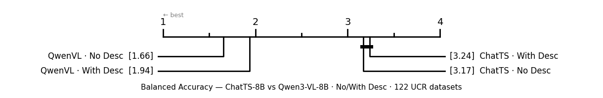
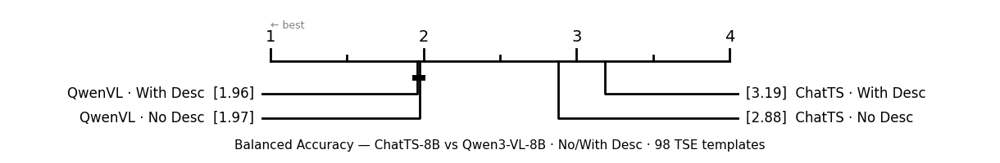

# Description Ablation Analysis

**Experiments:** `desc_ablation_full` (UCR, 122 datasets) · `tse_desc_ablation_full` (TSE, 94/98 templates)  
**Setup:** k=1 · random picking · 3 seeds (0, 3, 6) · ChatTS-8B · Qwen3-VL-8B  
**Condition A** (`use_label_desc=0`): labeled TS examples only  
**Condition B** (`use_label_desc=1`): description/question text prepended to prompt

---

## Prompt Samples

The only difference between conditions is the text block injected at the top of the prompt.

### UCR — No Desc (`use_label_desc=0`) · GunPoint dataset

```
Time Series Classification.

--- EXAMPLES ---

Example 1 Time Series: [-0.6479, -0.6420, -0.6382, -0.6383, -0.6383, -0.6387, ... (150 values total)]
Label: 2

Example 2 Time Series: [-0.7784, -0.7783, -0.7772, -0.7777, -0.7759, -0.7724, ... (150 values total)]
Label: 1

--- TARGET ---
New Time Series: [-1.1250, -1.1313, -1.1383, -1.1467, -1.1386, -1.1414, ... (150 values total)]
Return ONLY the label as one of: [1, 2] without any explanation
```

### UCR — With Desc (`use_label_desc=1`) · GunPoint dataset

```
Time Series Classification.
Motion tracking data of an actor's hand. The task is to classify whether the actor
is drawing a gun from a hip holster or simply pointing a finger.

--- EXAMPLES ---

Example 1 Time Series: [-0.6479, -0.6420, -0.6382, -0.6383, -0.6383, -0.6387, ... (150 values total)]
Label: 2

Example 2 Time Series: [-0.7784, -0.7783, -0.7772, -0.7777, -0.7759, -0.7724, ... (150 values total)]
Label: 1

--- TARGET ---
New Time Series: [-1.1250, -1.1313, -1.1383, -1.1467, -1.1386, -1.1414, ... (150 values total)]
Return ONLY the label as one of: [1, 2] without any explanation
```

### TSE — No Desc (`use_label_desc=0`) · tid=1 (trend type)

```
Time Series Classification.

--- EXAMPLES ---

Example 1 Time Series: [0.0491, -0.0171, 0.1237, 0.2489, 0.5246, 0.7387, ... (256 values total)]
Label: A

Example 2 Time Series: [1.3657, 0.4069, 2.0581, 1.0753, 0.9721, 2.7193, ... (256 values total)]
Label: B

Example 3 Time Series: [7.4760, 7.5438, 7.4944, 7.6086, 7.5968, 7.5744, ... (256 values total)]
Label: C

--- TARGET ---
New Time Series: [-1.0386, 0.5888, -0.5573, 0.9470, 0.7866, 0.0591, ... (256 values total)]
Return ONLY the label as one of: [A, B, C] without any explanation
```

### TSE — With Desc (`use_label_desc=1`) · tid=1 (trend type)

```
Time Series Classification.
Question: What is the type of the trend of the given time series?

Options:
A) Linear
B) Exponential
C) No Trend

--- EXAMPLES ---

Example 1 Time Series: [0.0491, -0.0171, 0.1237, 0.2489, 0.5246, 0.7387, ... (256 values total)]
Label: A

Example 2 Time Series: [1.3657, 0.4069, 2.0581, 1.0753, 0.9721, 2.7193, ... (256 values total)]
Label: B

Example 3 Time Series: [7.4760, 7.5438, 7.4944, 7.6086, 7.5968, 7.5744, ... (256 values total)]
Label: C

--- TARGET ---
New Time Series: [-1.0386, 0.5888, -0.5573, 0.9470, 0.7866, 0.0591, ... (256 values total)]
Return ONLY the label as one of: [A, B, C] without any explanation
```

---

## UCR — 122 Datasets

| Condition | Macro Bal. Acc | Δ vs No Desc | Wilcoxon |
|---|---|---|---|
| ChatTS · No Desc | 0.3245 | — | — |
| ChatTS · With Desc | 0.3213 | −0.0032 | p = 0.414 · n.s. |
| QwenVL · No Desc | 0.4322 | — | — |
| QwenVL · With Desc | 0.4192 | −0.0130 | p = 0.003 · ★★ |

| Model | Improved | Hurt | Tied |
|---|---|---|---|
| ChatTS-8B | 47 / 122 (38.5%) | 49 / 122 (40.2%) | 26 |
| Qwen3-VL-8B | 40 / 122 (32.8%) | 69 / 122 (56.6%) | 13 |

**Descriptions significantly hurt QwenVL on UCR. ChatTS effect is directionally negative but non-significant.**

---

## TSE — 94 Templates (4 failed: tids 64, 68, 73, 74)

| Condition | Macro Bal. Acc | Weighted Bal. Acc | Δ vs No Desc | Wilcoxon |
|---|---|---|---|---|
| ChatTS · No Desc | 0.6562 | 0.6566 | — | — |
| ChatTS · With Desc | 0.6051 | 0.6003 | −0.0511 | p = 0.007 · ★★ |
| QwenVL · No Desc | 0.7970 | 0.7874 | — | — |
| QwenVL · With Desc | 0.7981 | 0.7937 | +0.0011 | p = 0.746 · n.s. |

| Model | Improved | Hurt | Tied |
|---|---|---|---|
| ChatTS-8B | 30 / 94 (31.9%) | 51 / 94 (54.3%) | 13 |
| Qwen3-VL-8B | 39 / 94 (41.5%) | 36 / 94 (38.3%) | 19 |

**Descriptions significantly hurt ChatTS on TSE. QwenVL is neutral.**

### Accuracy as One Pooled Task (correct / total questions)

TSE test sets are always class-balanced (exactly 3 test samples per class → 6, 9, or 12 total per template). For balanced test sets, balanced accuracy = raw accuracy mathematically, so weighting by test size gives the exact pooled accuracy: total correct predictions / total questions across all 94 templates.

| Condition | Macro Bal. Acc (per template) | Pooled Accuracy (correct / total) | Total Questions |
|---|---|---|---|
| ChatTS · No Desc | 0.6562 | 0.6566 | 693 |
| ChatTS · With Desc | 0.6051 | 0.6003 | 693 |
| QwenVL · No Desc | 0.7970 | 0.7874 | 693 |
| QwenVL · With Desc | 0.7981 | 0.7937 | 693 |

The two columns differ slightly (e.g. QwenVL No Desc: 0.797 → 0.787) because templates with more questions (9 or 12) are on average harder than the shorter ones (6).

### Win Counts (94 templates)

| Condition | Templates Won | % |
|---|---|---|
| QwenVL · No Desc | 38 | 40.4% |
| QwenVL · With Desc | 32 | 34.0% |
| ChatTS · No Desc | 16 | 17.0% |
| ChatTS · With Desc | 8 | 8.5% |

### TSE — By Category

| Category | N tids | ChatTS Δ | QwenVL Δ |
|---|---|---|---|
| Causality Analysis | 7 | **−0.196** | +0.048 |
| Similarity Analysis | 17 | **−0.074** | −0.040 |
| Pattern Recognition | 48 | −0.043 | +0.003 |
| Anomaly Detection | 9 | −0.033 | +0.025 |
| Noise Understanding | 13 | +0.014 | +0.006 |

ChatTS is most harmed in Causality Analysis and Similarity Analysis. QwenVL is unaffected or mildly positive across all categories except Similarity Analysis.

### TSE — Most Harmed Templates

| tid | ChatTS Δ | QwenVL Δ | Question (truncated) |
|---|---|---|---|
| 45 | −0.519 | −0.259 | What is the most likely autocorrelation at lag 1? |
| 90 | −0.500 | 0.000 | Are the two TS flipped versions of each other? |
| 42 | −0.444 | −0.037 | What is the most likely variance of the given TS? |
| 100 | −0.444 | 0.000 | Is the TS a lagged version of the other? |
| 48 | −0.111 | −0.500 | Which TS is more likely to be an AR(1) process? |

### TSE — Most Helped Templates

| tid | ChatTS Δ | QwenVL Δ | Question (truncated) |
|---|---|---|---|
| 12 | +0.389 | +0.222 | Does the trend change sign or direction? |
| 65 | +0.222 | +0.333 | What is the anomaly type? |
| 80 | +0.333 | 0.000 | Two TS with upward trend — which has steeper slope? |
| 72 | −0.037 | +0.407 | Anomaly with short-term distortion — which type? |
| 99 | −0.167 | +0.444 | Is the TS a lagged version despite noise? |

---

## Critical Difference Diagrams

Friedman test + pairwise Wilcoxon with Holm–Bonferroni correction (α = 0.05). Conditions connected by a bar are **not** significantly different. Lower rank = better.

### UCR — 122 datasets



### TSE — 94 templates



On UCR, the two QwenVL conditions are not significantly different from each other, and neither are the two ChatTS conditions — but QwenVL (both) is significantly better than ChatTS (both).  
On TSE, the same cross-model gap holds. Within QwenVL the two conditions are indistinguishable (ranks 1.96 vs 1.97). Within ChatTS, With Desc is significantly worse than No Desc.

---

## Summary

| Benchmark | ChatTS Δ | Significant? | QwenVL Δ | Significant? |
|---|---|---|---|---|
| UCR (122 datasets) | −0.0032 | No (p=0.414) | −0.0130 | Yes (p=0.003) |
| TSE (94 templates) | −0.0511 | Yes (p=0.007) | +0.0011 | No (p=0.746) |

- **ChatTS-8B** is hurt by descriptions in both benchmarks. The effect is small and non-significant on UCR, but large and significant on TSE.
- **Qwen3-VL-8B** is significantly hurt on UCR but neutral on TSE. On TSE, where the description contains the actual question and option labels, QwenVL neither gains nor loses.
- In no setting does adding descriptions produce a significant positive effect for either model.

## Recommendation

Use `--use_label_desc 0` for both models on both benchmarks.
